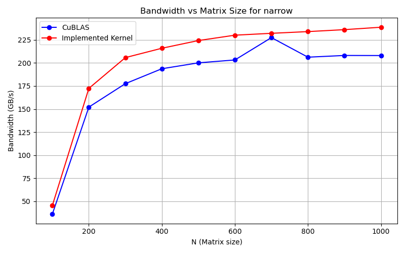
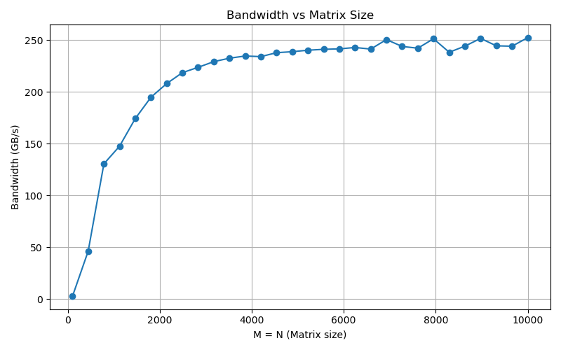

# Dense Linear Algebra: Atomic Contention & Tiling

### 📖 The Engineering Story
Matrix-vector (GEMV) and matrix-matrix (GEMM) multiplications are heavily memory-bound. Naive GPU implementations often rely on direct atomic additions to the output vector. As parallelism increases (especially for narrow matrices), multiple threads fighting to write to the same output address causes severe atomic contention, bottlenecking the entire streaming multiprocessor.

### 🛠️ The Implementation
I wrote custom CUDA kernels to bypass global atomic locks by utilizing fast on-chip memory:
- **Shared Memory Tiling:** Loaded segments of the matrix into `__shared__ float sdata[128]` to minimize global memory round-trips.
- **Tree-Based Reduction:** Implemented a strided, tree-based reduction across the warp (`for (int s = blockDim.x / 2; s > 0; s >>= 1)`) so that only a single thread per block needs to write the final partial sum to global memory.

### 🚀 The Results
The custom tiled kernels successfully saturated the GPU, hitting **252.25 GB/s** (78.9% of the NVIDIA Tesla T4's theoretical peak bandwidth). Furthermore, by drastically reducing atomic contention, the custom kernel actually outperformed NVIDIA's highly optimized `cuBLAS` library for narrow matrix geometries.

*Figure: Custom tree-reduction kernel outperforming cuBLAS SGEMV on narrow matrices.*

*Figure: Memory bandwidth scaling of the custom GEMV kernel up to ~252 GB/s.*

### 📂 Files
- [`gemv_tiled_reduction.cu`](./gemv_tiled_reduction.cu) - Custom kernels featuring shared memory tiling and warp-level reductions.
- [`gemv_cublas_baseline.cu`](./gemv_cublas_baseline.cu) - Baseline implementation used for benchmarking.