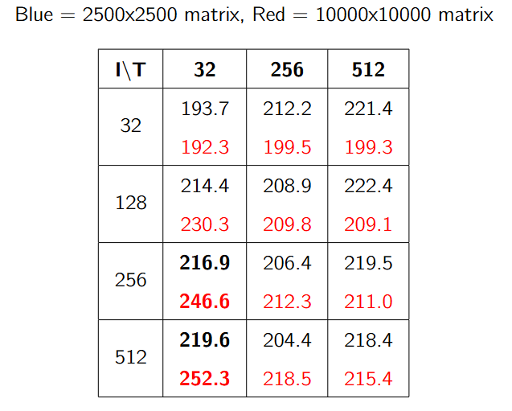

# Dense Linear Algebra: Hardware-Aware Kernel Tuning

### 📖 The Engineering Story
Matrix-vector operations (GEMV) are fundamentally memory-bound. However, simply writing a kernel that accesses memory in the correct order is not enough to achieve peak performance. To truly saturate the 320 GB/s bandwidth of an NVIDIA Tesla T4, the kernel must be tuned to keep the Streaming Multiprocessors (SMs) fully occupied, effectively hiding memory latency through optimal warp scheduling.

### 🛠️ The Implementation & Tuning
I wrote custom CUDA kernels for GEMV and Matrix-Matrix multiplication, focusing on hardware utilization rather than just algorithmic complexity:
- **Warp Scheduling & Occupancy:** Performed a grid-search across thread block dimensions and loop iteration counts per thread. I found that launching a large number of threads per block (512) with a smaller amount of work per thread (32 loops) allowed threads to complete work quickly, keeping the warp scheduler constantly fed.
- **Memory Coalescing:** Designed the kernel so that threads within a warp access contiguous memory segments, allowing the hardware to coalesce reads into wide memory transactions.
- **Shared Memory Tiling:** For transposed operations, I utilized `__shared__` memory buffers combined with a strided access pattern across the warp to maintain coalesced reads before performing tree-based reductions, reducing atomic calls.

### 🚀 The Results
By optimizing the thread-to-workload ratio, the custom kernel successfully saturated the SMs as problem sizes scaled up. 
- Achieved a peak effective bandwidth of **252.25 GB/s** (78.9% of the hardware's theoretical limit).
- For narrow matrix geometries, the tuned memory access patterns actually **outperformed standard `cuBLAS` implementations**, demonstrating the value of geometry-specific kernel tuning.

*Figure: Grid-search profiling of Thread block size vs Iterations per thread to maximize warp scheduling efficiency.*

*Figure: The custom tuned kernel outperforming cuBLAS SGEMV on narrow matrices.*

### 📂 Files
- [`gemv_tiled_reduction.cu`](./gemv_tiled_reduction.cu) - Custom kernels featuring coalesced memory access, shared memory tiling, and warp-level reductions.
- [`gemv_cublas_baseline.cu`](./gemv_cublas_baseline.cu) - Baseline implementation used for benchmarking.
