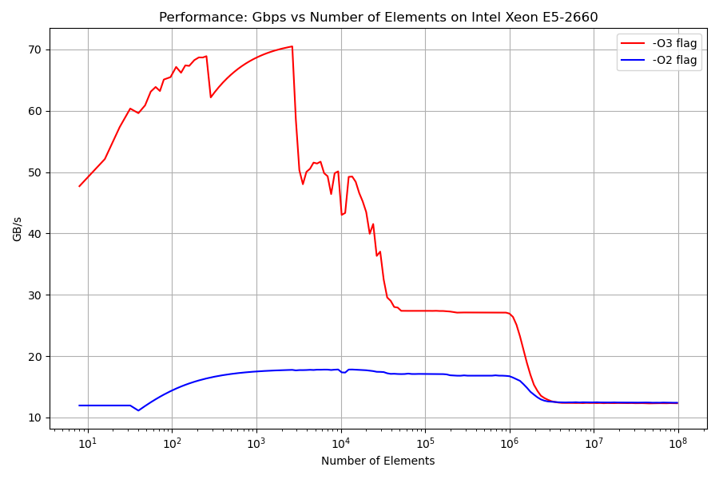
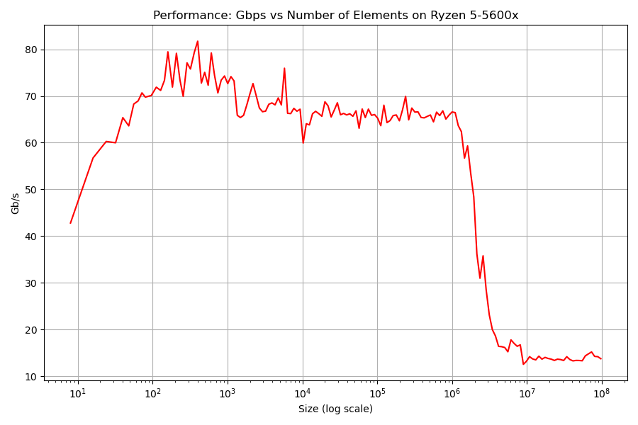
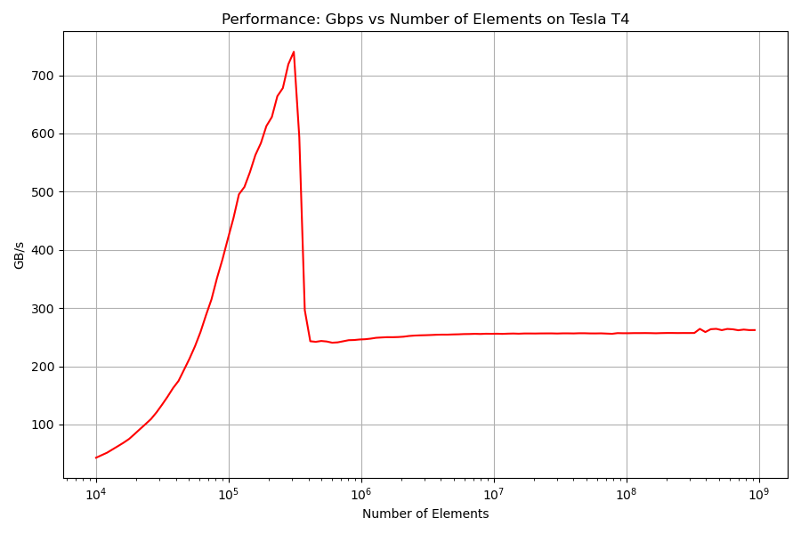

# Cross-Architecture Hardware Profiling

### 📖 The Engineering Story
High-performance code is heavily dependent on the underlying silicon. A memory access pattern that works well on an Intel chip might behave differently on AMD due to L3 cache topologies, and it will behave entirely differently on a GPU. Before optimizing complex numerical algorithms, I used the STREAM Triad benchmark to map the physical memory hierarchies and absolute bandwidth ceilings across three distinct architectures.

### 🛠️ The Profiling Methodology
I evaluated memory-bound workloads (scalar, auto-vectorized SIMD, and CUDA) across three different hardware environments:
- **Intel Xeon (Server CPU):** Profiled on the UPPMAX Snowy cluster to establish baseline enterprise data-center metrics.
- **AMD Ryzen (Consumer/Workstation CPU):** Profiled to contrast AMD's specific L2/L3 cache layout and memory latency against Intel's architecture.
- **NVIDIA GPU (Tesla T4):** Profiled using both single (`float`) and double (`double`) precision CUDA kernels to map VRAM bandwidth limits.

### 🚀 The Results & Insights
The profiling successfully visualized the exact boundaries where data spills out of L1, L2, and L3 caches into main memory (DRAM) across both CPU architectures. 

- **CPU Cache Topologies:** The data revealed distinct cache fall-off "cliffs" for both the Xeon and Ryzen chips as array sizes scaled up to $10^9$ elements, highlighting the exact array sizes where memory latency spikes.
- **CPU vs. GPU Bandwidth:** Established the baseline DRAM limit for the CPUs (~30-50 GB/s) versus the massive VRAM throughput of the GPU (~250+ GB/s), proving mathematically why algorithms like Lanczos *must* be kept entirely on-device to avoid PCIe bottlenecking.

*Figure: L1/L2/L3 cache boundaries and SIMD vs Scalar bandwidth on Intel Xeon.*

*Figure: Comparative cache drop-offs and memory throughput on AMD Ryzen.*

*Figure: VRAM bandwidth saturation mapping on the NVIDIA Tesla T4.*