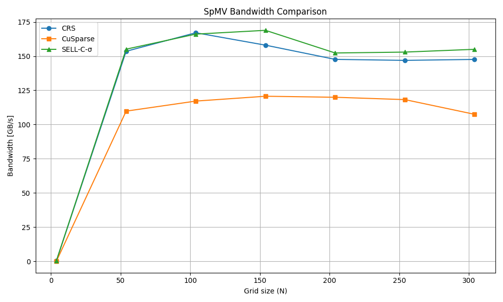
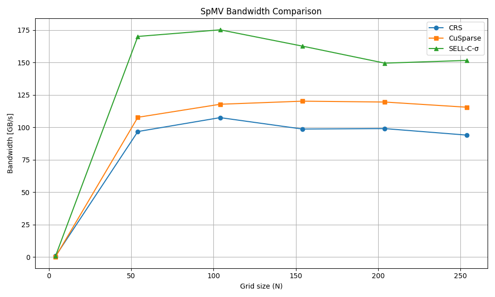
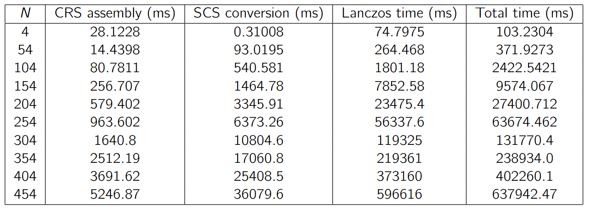

# Sparse Storage & Krylov Solvers: CRS vs SELL-C-σ

### 📖 The Engineering Story
Solving the 3D diffusion equation requires calculating massive matrix exponentials. Storing the 3D discrete Laplacian operator as a dense matrix requires $\mathcal{O}(N^6)$ memory, making it impossible to compute on a GPU for large grids. 

While Compressed Row Storage (CRS) solves the memory footprint problem, it destroys GPU performance. In my initial profiling, the irregular row lengths inherent to CRS caused severe warp divergence and un-coalesced memory reads, resulting in **78% of the transferred memory being wasted**.

### 🛠️ The Implementation
To fix this, I implemented the **SELL-C-σ** sparse matrix format:
- Divided matrix rows into chunks of 32 (`C=32`).
- Sorted the rows by non-zero count within each chunk (`σ=1`).
- Padded rows with zeros to ensure uniform length.
- Wrote a fully on-device Lanczos algorithm loop to prevent PCIe transfer bottlenecks.

### 🚀 The Results & Pipeline Analysis
By restructuring the data to fit the hardware, the SELL-C-σ SpMV kernel achieved nearly perfect warp coalescing. 
- **Memory waste dropped from 78% to just 3%.**
- Achieved a sustained effective memory bandwidth of **~148 GB/s**.

**End-to-End Algorithmic Scaling:**
A critical insight from profiling the entire Lanczos pipeline was that the upfront cost of converting the matrix from CRS to SELL-C-σ grows much slower than the iterative Lanczos execution time. For realistically large 3D grids ($N > 150$), the conversion overhead becomes negligible, proving that paying the upfront penalty to restructure data into hardware-aware formats yields massive net-positive execution times for iterative solvers.

*Figure: Effective memory bandwidth of CRS vs SELL-C-σ vs standard cuBLAS FP32.*

*Figure: Effective memory bandwidth of CRS vs SELL-C-σ vs standard cuBLAS FP64.*

### 📂 Files
- [`lanczos_sellcsigma.cu`](./lanczos_sellcsigma.cu) - Contains the CRS matrix assembly, CPU-side SELL-C-σ conversion, the optimized SpMV kernel, and the on-device Lanczos solver.